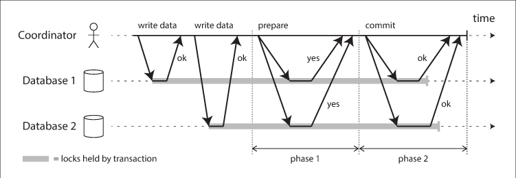
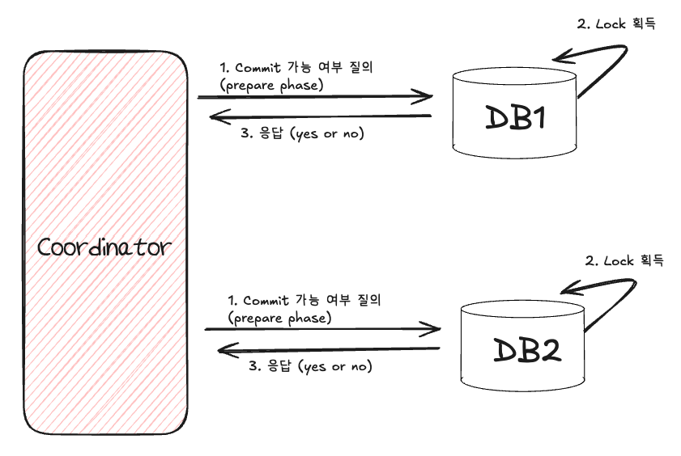
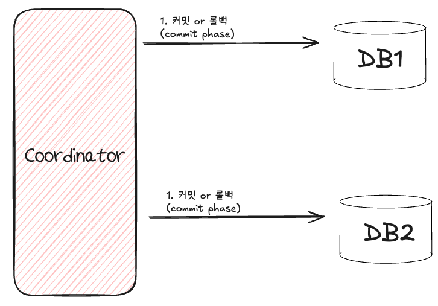

MSA 환경에서 고민해야되는 포인트는 도메인별로 분산된 DB를 가질때의 트랜잭션 관리다.

단일 DB에서 제공하는 트랜잭션을 활용할 수 없다보니 전체적인 데이터 일관성과 무결성을 보장하기 위한 고민이 필요하다.

이를 해결하기 위한 대표적인 방식인 2PC(2Phase Commit)과 Saga Pattern에 대해 알아보자.

# 2PC(2Phase Commit) 프로토콜
MSA 가 대중화 되기 이전에 분산 데이터베이스 환경에서 데이터 일관성을 만족시키기 위해 널리 사용되었던 프로토콜 중 하나다.

참고로 사용하는 DBMS가 분산 트랜잭션을 지원해야 사용할 수 있으며, 같은 종류의 DBMS여야 한다.

전체적인 흐름은 중간의 Coorinator가 2단계(준비, 커밋)로 나뉘어 커밋을 진행하는 방식이다.

**1) 준비 단계(prepare phase)**

첫 번째, 준비 단계에서는 Coorinator가 모든 노드(DBMS)에 트랜잭션 열어 Lock을 획득후 커밋 가능 여부를 응답한다.

**2) 커밋 단계(commit phase)**

두 번째, 커밋 단계에서는 모든 노드가 준비 완료될 경우 commit 요청을 전송하고, 만약 하나라도 준비 실패한다면 rollback 요청을 보냄으로써 두 노드간의 데이터 일관성을 보장한다.

## 2PC 단점

# Saga Pattern

## Choreography Saga 패턴

## Orchestration Saga 패턴
